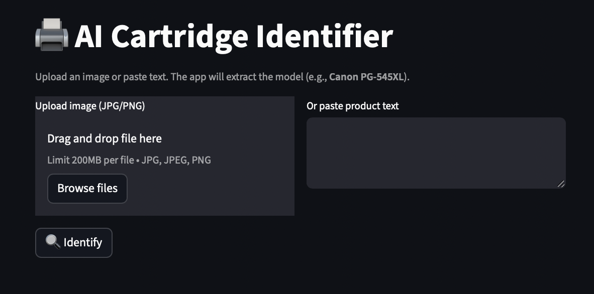

# 🖨️ AI Cartridge Identifier

An intelligent assistant that helps you **quickly detect printer cartridge models** from packaging, labels, or product descriptions.  
The tool combines **OCR** for text extraction and **AI (OpenAI models)** for classification, all wrapped in a sleek **dark-themed web interface**.  

---

## 🔑 What It Does
- 📷 Upload an **image** of cartridge packaging or text → system extracts model name  
- ✍️ Paste or type cartridge **description text** → AI suggests most probable model  
- 📊 Displays results with confidence score + candidate matches  
- 🌙 Modern **dark UI** for comfortable daily use  

---

## 📸 Preview


---

## ⚡ Getting Started

1. Clone the repository:
   ```bash
   git clone git@github.com:auroraai77/ai-cartridge-identifier-final.git
   cd ai-cartridge-identifier-final
